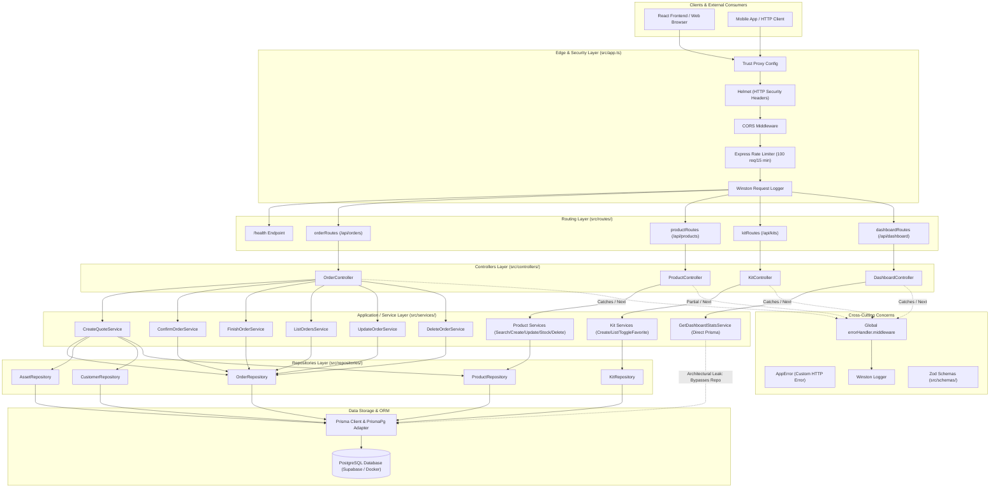
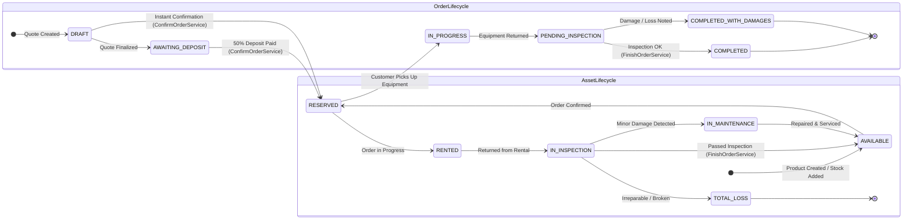

# Comprehensive Backend Architectural Survey Report

**Project:** Backend CRM Pegue-e-Monte (`backend-boilerplate`)  
**Investigator:** `explorer_survey_1` (Codebase Architecture Explorer)  
**Date:** 2026-09-09  
**Status:** Completed  
**Repository Working Directory:** `/home/workspace/backend-boilerplate`

---

## 1. Executive Summary

This report delivers an exhaustive architectural survey and audit of the `backend-boilerplate` codebase, an equipment rental CRM ("Pegue-e-Monte") backend built with **Node.js 20**, **Express 5.2.1**, **TypeScript 6.0.3 / ES2022**, and **Prisma ORM 7.8.0** with PostgreSQL (`@prisma/adapter-pg` / `pg`).

The codebase follows an approximation of Clean Architecture / Layered Architecture (`Routes` -> `Controllers` -> `Services/Use Cases` -> `Repositories` -> `Prisma ORM` -> `PostgreSQL`), accompanied by domain state machines for orders and physical rental assets. 

However, deep-dive examination reveals significant architectural flaws, configuration anomalies, guideline violations against `GEMINI.md`, and 53 silent TypeScript compiler errors that are masked because CI only runs `tsup` and `vitest` without `tsc --noEmit`.

---

## 2. Directory Tree & Complete File Inventory

### 2.1 Complete Directory Tree (Excluding `node_modules`, `.git`, `.agents`, `dist`)

```
backend-boilerplate/
├── .env
├── .github/
│   └── workflows/
│       ├── ci.yml
│       └── codeql.yml
├── .gitignore
├── API_DOCS.md
├── docker-compose.yml
├── eslint.config.mts
├── GEMINI.md
├── implementation_plan.md
├── logs/
│   ├── combined.log
│   └── error.log
├── ORIGINAL_REQUEST.md
├── package-lock.json
├── package.json
├── prisma/
│   ├── migrations/
│   │   ├── 20260702222334_init_postgres/
│   │   │   └── migration.sql
│   │   └── migration_lock.toml
│   └── schema.prisma
├── prisma.config.ts
├── README.md
├── src/
│   ├── app.ts
│   ├── server.ts
│   ├── controllers/
│   │   ├── DashboardController.ts
│   │   ├── KitController.ts
│   │   ├── order.controller.ts
│   │   └── ProductController.ts
│   ├── domain/
│   │   ├── AssetState.ts
│   │   └── OrderState.ts
│   ├── errors/
│   │   └── AppError.ts
│   ├── middlewares/
│   │   ├── errorHandler.middleware.ts
│   │   └── logging.middleware.ts
│   ├── repositories/
│   │   ├── AssetRepository.ts
│   │   ├── CustomerRepository.ts
│   │   ├── KitRepository.ts
│   │   ├── OrderRepository.ts
│   │   └── ProductRepository.ts
│   ├── routes/
│   │   ├── dashboard.routes.ts
│   │   ├── kit.routes.ts
│   │   ├── order.routes.ts
│   │   └── product.routes.ts
│   ├── schemas/
│   │   └── order.schema.ts
│   ├── services/
│   │   ├── ConfirmOrderService.ts
│   │   ├── CreateKitService.ts
│   │   ├── CreateProductService.ts
│   │   ├── CreateQuoteService.ts
│   │   ├── DeleteOrderService.ts
│   │   ├── DeleteProductService.ts
│   │   ├── FinishOrderService.ts
│   │   ├── GetDashboardStatsService.ts
│   │   ├── ListKitsService.ts
│   │   ├── ListOrdersService.ts
│   │   ├── SearchProductsService.ts
│   │   ├── ToggleFavoriteKitService.ts
│   │   ├── UpdateOrderService.ts
│   │   ├── UpdateProductService.ts
│   │   └── UpdateProductStockService.ts
│   └── tests/
│       ├── example.test.ts
│       └── services/
│           ├── ConfirmOrderService.spec.ts
│           ├── CreateProductService.spec.ts
│           ├── CreateQuoteService.spec.ts
│           ├── DeleteOrderService.spec.ts
│           ├── DeleteProductService.spec.ts
│           ├── FinishOrderService.spec.ts
│           ├── UpdateOrderService.spec.ts
│           ├── UpdateProductService.spec.ts
│           └── UpdateProductStockService.spec.ts
└── tsconfig.json
```

### 2.2 File Inventory Table

| File Path | Layer / Category | Lines | Purpose |
| :--- | :--- | :--- | :--- |
| `package.json` | Configuration | 48 | Project dependencies, scripts, metadata |
| `tsconfig.json` | Configuration | 14 | TypeScript compiler configuration (ES2022, Bundler, Strict) |
| `docker-compose.yml` | Infrastructure | 16 | Local PostgreSQL 15 container definition |
| `prisma.config.ts` | Configuration | 12 | Prisma 7 datasource and migration configuration |
| `prisma/schema.prisma` | Persistence Model | 128 | Database entities: Customer, ProductBase, Asset, Order, OrderAsset, Kit, KitItem |
| `prisma/migrations/20260702222334_init_postgres/migration.sql` | Database Migration | 108 | Initial schema migration (lacks Kit/KitItem tables) |
| `eslint.config.mts` | Code Quality | 11 | ESLint flat config with `@eslint/js` and `typescript-eslint` |
| `.env` | Environment | 2 | Runtime env vars (`PORT`, `DATABASE_URL`) |
| `.github/workflows/ci.yml` | CI/CD | 32 | GitHub Actions workflow: lint, build, test |
| `.github/workflows/codeql.yml` | CI/CD | 40 | CodeQL security analysis workflow |
| `README.md` | Documentation | 80 | Developer onboarding and local execution instructions |
| `API_DOCS.md` | Documentation | 191 | Public API endpoint reference (has drift with implementation) |
| `implementation_plan.md` | Documentation | 284 | Frontend consumer implementation plan |
| `src/server.ts` | Entry Point | 10 | HTTP server port listening bootstrap |
| `src/app.ts` | App Bootstrap | 44 | Express instance, global middlewares, route mounting |
| `src/errors/AppError.ts` | Error Handling | 12 | Custom application error class with HTTP status code |
| `src/middlewares/errorHandler.middleware.ts` | Middleware | 37 | Global Express error handler for AppError, ZodError, 500 |
| `src/middlewares/logging.middleware.ts` | Middleware | 79 | Winston HTTP request logger and unused errorLogger |
| `src/domain/OrderState.ts` | Domain Model | 10 | Enum for rental order states (`DRAFT` to `COMPLETED_WITH_DAMAGES`) |
| `src/domain/AssetState.ts` | Domain Model | 9 | Enum for physical equipment state (`AVAILABLE`, `RENTED`, etc.) |
| `src/schemas/order.schema.ts` | Validation | 36 | Zod validation schemas for quote creation and confirmation |
| `src/routes/dashboard.routes.ts` | Routing | 21 | Mounts `/api/dashboard/stats`, creates Pool/Prisma |
| `src/routes/kit.routes.ts` | Routing | 33 | Mounts `/api/kits`, creates Pool/Prisma |
| `src/routes/order.routes.ts` | Routing | 68 | Mounts `/api/orders`, creates Pool/Prisma |
| `src/routes/product.routes.ts` | Routing | 52 | Mounts `/api/products`, creates Pool/Prisma |
| `src/controllers/DashboardController.ts` | Controller | 22 | Handles dashboard stats endpoint |
| `src/controllers/KitController.ts` | Controller | 64 | Handles kit creation, listing, and favorite toggle |
| `src/controllers/order.controller.ts` | Controller | 121 | Handles quotes, orders, updates, deletion |
| `src/controllers/ProductController.ts` | Controller | 132 | Handles product search, create, update, stock, delete |
| `src/services/ConfirmOrderService.ts` | Service / Use Case | 99 | Confirms order with 50% deposit and availability re-check |
| `src/services/CreateKitService.ts` | Service / Use Case | 22 | Creates bundle kit with item products |
| `src/services/CreateProductService.ts` | Service / Use Case | 50 | Creates product base and generates serialized assets |
| `src/services/CreateQuoteService.ts` | Service / Use Case | 131 | Quotes rental order with buffer day and availability check |
| `src/services/DeleteOrderService.ts` | Service / Use Case | 34 | Deletes order in permitted lifecycle states |
| `src/services/DeleteProductService.ts` | Service / Use Case | 40 | Deletes product if no active rentals or order history |
| `src/services/FinishOrderService.ts` | Service / Use Case | 57 | Completes order and releases assets to AVAILABLE |
| `src/services/GetDashboardStatsService.ts` | Service / Use Case | 78 | Aggregates metrics directly via Prisma queries |
| `src/services/ListKitsService.ts` | Service / Use Case | 10 | Lists all promotional kits with items |
| `src/services/ListOrdersService.ts` | Service / Use Case | 14 | Lists all orders with customer and assets |
| `src/services/SearchProductsService.ts` | Service / Use Case | 53 | Paginated product search with computed stock counts |
| `src/services/ToggleFavoriteKitService.ts` | Service / Use Case | 18 | Toggles kit favorite state |
| `src/services/UpdateOrderService.ts` | Service / Use Case | 76 | Updates dates/amount with collision check |
| `src/services/UpdateProductService.ts` | Service / Use Case | 52 | Updates product base details and pricing |
| `src/services/UpdateProductStockService.ts` | Service / Use Case | 78 | Adds or prunes available serialized assets |
| `src/repositories/AssetRepository.ts` | Repository | 86 | Asset queries and date-range availability checks |
| `src/repositories/CustomerRepository.ts` | Repository | 33 | Customer upsert by email/document |
| `src/repositories/KitRepository.ts` | Repository | 76 | Kit and KitItem CRUD queries |
| `src/repositories/OrderRepository.ts` | Repository | 151 | Order CRUD, asset conflict checking, state transitions |
| `src/repositories/ProductRepository.ts` | Repository | 143 | Product pagination, asset generation, stock management |
| `src/tests/example.test.ts` | Test | 30 | Vitest sanity checks |
| `src/tests/services/*.spec.ts` (9 files) | Tests | ~600 | Unit tests for domain services using Vitest mocks |

---

## 3. Technology Stack, Dependencies & Configuration

### 3.1 Technology Stack Matrix

| Component | Technology | Version | Purpose / Characteristics |
| :--- | :--- | :--- | :--- |
| **Runtime** | Node.js | v20+ (ESM `"type": "module"`) | Modern JavaScript runtime |
| **Web Framework** | Express | `^5.2.1` | Express 5.x with native promise handling |
| **Language** | TypeScript | `^6.0.3` | Target `ES2022`, module `ESNext`, resolution `Bundler` |
| **ORM / Data** | Prisma | `^7.8.0` | Driver adapter `@prisma/adapter-pg` + `pg` 8.21 |
| **Database** | PostgreSQL | 15 Alpine (Docker) / Supabase | Relational data store |
| **Validation** | Zod | `^4.4.2` | Schema definition & input parsing (Zod v4) |
| **Logging** | Winston | `^3.19.0` | Structured JSON / colorized console logging |
| **Security** | Helmet & Rate Limit | `helmet@^8.1.0`, `express-rate-limit@^7.4.1` | HTTP security headers, brute force limiter |
| **CORS** | cors | `^2.8.6` | Cross-origin resource sharing |
| **Build Tool** | tsup | `^8.5.1` | Fast esbuild-based bundler |
| **Dev Server** | tsx | `^4.21.0` | TypeScript execute & watch |
| **Test Runner** | Vitest | `^2.1.0` | Vite-native unit test runner |
| **Linter / Formatter**| ESLint & Prettier | `eslint@^10.3.0`, `prettier@^3.3.3` | Code quality and formatting |

### 3.2 Configuration Files Analysis

#### `package.json`
- `"type": "module"` enables ES modules across the application.
- Scripts:
  - `dev`: `tsx watch src/server.ts` — hot reload development server.
  - `build`: `tsup src --out-dir=dist --clean` — builds all source files into CJS bundles. Note: this bundles all test files into `dist/tests/` as well.
  - `start`: `node dist/server.cjs` — production entrypoint.
  - `lint`: `eslint src --ext .ts --fix` — invokes ESLint.
  - `test`: `vitest` / `test:watch`: `vitest --watch` — runs unit test suite.
  - **Critical Omission**: There is no `typecheck` script (e.g. `tsc --noEmit`).

#### `tsconfig.json`
```json
{
  "compilerOptions": {
    "target": "ES2022",
    "module": "ESNext",
    "moduleResolution": "Bundler",
    "rootDir": "./src",
    "outDir": "./dist",
    "esModuleInterop": true,
    "forceConsistentCasingInFileNames": true,
    "strict": true,
    "skipLibCheck": true
  },
  "include": ["src/**/*"]
}
```
- `strict: true` is enabled, but type checking is bypassed during build and CI!

#### `docker-compose.yml`
- Defines service `db` with `postgres:15-alpine`, user/password `postgres`/`postgres`, database `rentaldemo`, exposed on port `5432:5432`.
- Contrast with `.env`: `.env` does not point to `localhost:5432/rentaldemo`, but to an external pooled Supabase instance (`aws-0-us-east-1.pooler.supabase.com:6543/postgres`).

#### `prisma.config.ts` & `prisma/schema.prisma`
- Prisma 7 configuration file loads `.env` and defines schema path `prisma/schema.prisma`.
- Entities in `schema.prisma`:
  1. `Customer`: id, name, email (unique), phone, document (unique), score, createdAt, updatedAt.
  2. `ProductBase`: id, name, description, dailyPrice (Decimal 10,2), category (`ProductCategory`), imageUrl.
  3. `Asset`: Physical item serialized under `ProductBase`. id, productBaseId, serialNumber (unique), state (`AssetState`).
  4. `Order`: Rental contract. id, customerId, state (`OrderState`), totalAmount, amountPaid, pickUpDate, returnDate.
  5. `OrderAsset`: Explicit N:M associative table linking `Order` and `Asset` with composite primary key `@@id([orderId, assetId])`.
  6. `MaintenanceLog`: id, assetId, description, cost, resolved.
  7. `Kit`: Bundled promotional package. id, name, description, price, isFavorited.
  8. `KitItem`: Items inside a Kit referencing `ProductBase` and `quantity`.

#### `eslint.config.mts`
- Flat config format ignoring `dist/**`, configuring `@eslint/js` and `tseslint.configs.recommended`.

---

## 4. Application Lifecycle & Entry Points

### 4.1 Bootstrap Sequence

```
1. Process Startup
   ├── tsx watch src/server.ts (Dev) OR node dist/server.cjs (Prod)
   └── import 'dotenv/config' (Loads .env into process.env)

2. Application Initialization (src/app.ts)
   ├── express() instance created
   ├── app.set('trust proxy', 1) (For reverse proxies / rate-limit real IP)
   ├── rateLimit configured (100 req / 15 min per IP)
   ├── app.use(helmet())
   ├── app.use(cors()) (Permissive, unrestricted origin)
   ├── app.use(express.json())
   ├── app.use(requestLogger) (Winston HTTP logging on start & finish)
   ├── app.use(limiter) (Applied to ALL endpoints, including /health)
   ├── Routes mounted:
   │   ├── GET /health -> inline handler
   │   ├── /api/orders -> orderRoutes
   │   ├── /api/products -> productRoutes
   │   ├── /api/kits -> kitRoutes
   │   └── /api/dashboard -> dashboardRoutes
   └── app.use(errorHandler) (Last middleware: handles AppError, ZodError, 500)

3. Server Listen (src/server.ts)
   └── app.listen(PORT, callback) (Defaults to PORT 3333)
```

### 4.2 Lifecycle Deficiencies
- **No Graceful Shutdown**: `server.ts` does not handle `SIGINT` or `SIGTERM`. Active database connections and in-flight HTTP requests are dropped abruptly on shutdown.
- **No Database Health Check**: `/health` only returns `{ status: 'OK', uptime: process.uptime() }`. It does not ping PostgreSQL or Prisma.
- **Unused Error Logger**: `errorLogger` in `src/middlewares/logging.middleware.ts` is defined and exported, but never mounted in `src/app.ts`.

---

## 5. Layered Architecture Deep-Dive

### 5.1 Routes Layer (`src/routes/`)
- Contains 4 route modules: `dashboard.routes.ts`, `kit.routes.ts`, `order.routes.ts`, `product.routes.ts`.
- **Architectural Violation**: Each of the 4 route modules instantiates its own `pg.Pool`, `PrismaPg` adapter, `PrismaClient`, Repositories, Services, and Controller at module evaluation time.
  ```typescript
  // Duplicated across order.routes.ts, product.routes.ts, kit.routes.ts, dashboard.routes.ts:
  const connectionString = `${process.env.DATABASE_URL}`;
  const pool = new Pool({ connectionString });
  const adapter = new PrismaPg(pool);
  const prisma = new PrismaClient({ adapter });
  ```
  This creates **4 separate connection pools** and **4 separate PrismaClient instances** instead of sharing a centralized database client instance (`src/lib/prisma.ts` or `src/config/database.ts`).

### 5.2 Controllers Layer (`src/controllers/`)
- Contains: `DashboardController.ts`, `KitController.ts`, `order.controller.ts`, `ProductController.ts`.
- **Inconsistencies**:
  - **Naming**: `order.controller.ts` uses kebab/dot-case while all other controllers use PascalCase (`ProductController.ts`, `KitController.ts`, `DashboardController.ts`).
  - **Error Flow**: 
    - `DashboardController`, `KitController`, and parts of `order.controller` use `try { ... } catch (error) { next(error); }` properly delegating to `errorHandler`.
    - `ProductController` and `order.controller.ts` (`update`, `delete`) catch errors internally, inspect status codes with unsafe casts (`const err = error as { statusCode?: number; message?: string }`), and call `res.status(statusCode).json(...)`, bypassing `errorHandler` and using `console.error` instead of Winston.
  - **Validation Placement**: `KitController` and `ProductController` define Zod schemas inline inside controller action methods rather than in `src/schemas/`.
  - **Missing Route Param Validation**: None of the controllers validate UUID route parameters (`req.params.id`, `req.params.orderId`) using Zod.

### 5.3 Services / Use Cases Layer (`src/services/`)
- Contains 15 use cases encapsulating business rules:
  1. `ConfirmOrderService`: Re-validates equipment availability with a +1 day cleaning buffer, verifies >= 50% deposit, updates order to `RESERVED` and assets to `RENTED`.
  2. `CreateQuoteService`: Checks inventory availability across date range (+1 buffer day), calculates total cost, automatically upserts customer, and creates `DRAFT` order.
  3. `FinishOrderService`: Validates order state and sets order to `COMPLETED` and assets to `AVAILABLE`.
  4. `DeleteOrderService`: Restricts deletion to allowable order states.
  5. `UpdateOrderService`: Updates rental dates/amounts with reservation collision check.
  6. `ListOrdersService`: Retrieves orders list.
  7. `CreateProductService`: Creates product base and automatically generates serialized `Asset` records.
  8. `SearchProductsService`: Performs paginated product search, computing available vs total stock.
  9. `UpdateProductService`: Updates product catalog details.
  10. `UpdateProductStockService`: Increases stock by generating assets or prunes available assets.
  11. `DeleteProductService`: Blocks deletion if assets are rented or orders exist.
  12. `CreateKitService`: Creates bundled kit items.
  13. `ListKitsService`: Retrieves all kits.
  14. `ToggleFavoriteKitService`: Toggles kit bookmark flag.
  15. `GetDashboardStatsService`: Aggregates KPI statistics.

- **Architectural Deviations in Services**:
  - `GetDashboardStatsService.ts` injects `PrismaClient` directly, completely skipping the repository layer.
  - `DeleteProductService.ts` imports and matches `Prisma.PrismaClientKnownRequestError` directly in the service, breaking layer isolation.
  - `UpdateProductStockService.ts` and `DeleteProductService.ts` call `productRepository.update(id, {})` as an empty update hack just to fetch a product with its assets.
  - `DeleteOrderService.ts`, `FinishOrderService.ts`, and `UpdateOrderService.ts` reference `OrderState.TOTAL_LOSS` which does not exist on `OrderState` (it is an `AssetState`), breaking typecheck.

### 5.4 Repositories Layer (`src/repositories/`)
- Contains: `AssetRepository.ts`, `CustomerRepository.ts`, `KitRepository.ts`, `OrderRepository.ts`, `ProductRepository.ts`.
- All repositories receive `PrismaClient` via constructor injection.
- Methods encapsulate Prisma queries:
  - `AssetRepository`: Complex availability filtering excluding overlapping orders with blocking states (`AWAITING_DEPOSIT`, `RESERVED`, `IN_PROGRESS`, `PENDING_INSPECTION`).
  - `CustomerRepository`: Finds by email OR document; creates if absent.
  - `OrderRepository`: Creates orders with nested `OrderAsset` connect relations; checks collisions.
  - `ProductRepository`: Paginated search with case-insensitive filtering; asset generation with serial format `${PREFIX}-${Date.now()}-${index}`.
- **Repository Flaws**:
  - `ProductRepository.findById` does not support including assets, causing services to use empty `update` workarounds.
  - No transactional execution wrapper (`prisma.$transaction`) provided for multi-repository actions.

### 5.5 Domain Layer (`src/domain/`)
- Contains enums: `AssetState.ts` and `OrderState.ts`.
- Models match Prisma schema:
  - `OrderState`: `DRAFT`, `AWAITING_DEPOSIT`, `RESERVED`, `IN_PROGRESS`, `PENDING_INSPECTION`, `COMPLETED`, `COMPLETED_WITH_DAMAGES`.
  - `AssetState`: `AVAILABLE`, `RESERVED`, `RENTED`, `IN_INSPECTION`, `IN_MAINTENANCE`, `TOTAL_LOSS`.

### 5.6 Middlewares & Error Handling Layer (`src/middlewares/`, `src/errors/`)
- `AppError.ts`: Custom error holding HTTP status code (defaults to 400).
- `logging.middleware.ts`: Winston logger with console transport (colorized in dev, JSON in prod). Attaches `requestLogger` tracking duration and status.
- `errorHandler.middleware.ts`:
  - Catches `AppError`: logs warn, returns `{ error: err.message }` with `err.statusCode`.
  - Catches `z.ZodError`: logs warn, returns `{ error: "Validation failed", details: err.errors }` with 400. Note: in Zod 4, `err.errors` is undefined / changed to `err.issues`.
  - Fallback: logs error with stack, returns `{ error: "Internal server error" }` with 500.

---

## 6. End-to-End Data Flows & Request-Response Cycles

Below is the exhaustive mapping of every endpoint in the backend:

| Method | Path | Controller Method | Service Invoked | Repositories Used | Database Operations | HTTP Responses |
| :--- | :--- | :--- | :--- | :--- | :--- | :--- |
| `GET` | `/health` | Inline (`src/app.ts`) | None | None | None | 200 `{ status: 'OK', uptime }` |
| `POST` | `/api/orders/quotes` | `OrderController.createQuote` | `CreateQuoteService` | `ProductRepo`, `AssetRepo`, `CustomerRepo`, `OrderRepo` | `ProductBase.findUnique`, `Asset.count`, `Asset.findMany`, `Customer.findFirst/create`, `Order.create` | 201 `{ order }`, 400 (validation), 404, 409 (insufficient stock) |
| `POST` | `/api/orders/:orderId/confirm` | `OrderController.confirmOrder` | `ConfirmOrderService` | `OrderRepo` | `Order.findUnique`, `Order.findMany` (collision check), `Order.update`, `Asset.updateMany` | 200 `{ order }`, 400 (invalid state/deposit), 404, 409 (conflict) |
| `POST` | `/api/orders/:id/finish` | `OrderController.finishOrder` | `FinishOrderService` | `OrderRepo` | `Order.findUnique`, `Order.update`, `Asset.updateMany` | 200 `{ order }`, 400, 404 |
| `GET` | `/api/orders` | `OrderController.listOrders` | `ListOrdersService` | `OrderRepo` | `Order.findMany` (include customer, assets, product) | 200 `[orders]` |
| `PUT` | `/api/orders/:id` | `OrderController.update` | `UpdateOrderService` | `OrderRepo` | `Order.findUnique`, `Order.findMany` (conflict check), `Order.update` | 200 `{ order }`, 400, 404, 409 |
| `DELETE` | `/api/orders/:id` | `OrderController.delete` | `DeleteOrderService` | `OrderRepo` | `Order.findUnique`, `OrderAsset.deleteMany`, `Order.delete` | 204 No Content, 400, 404 |
| `GET` | `/api/products` | `ProductController.index` | `SearchProductsService` | `ProductRepo` | `ProductBase.findMany` (include assets), `ProductBase.count` | 200 `{ data, total, page, limit }`, 400, 500 |
| `POST` | `/api/products` | `ProductController.create` | `CreateProductService` | `ProductRepo` | `ProductBase.create` (nested asset create) | 201 `{ product }`, 400, 500 |
| `PUT` | `/api/products/:id` | `ProductController.update` | `UpdateProductService` | `ProductRepo` | `ProductBase.findUnique`, `ProductBase.update` (include assets) | 200 `{ product }`, 400, 404, 500 |
| `PATCH` | `/api/products/:id/stock` | `ProductController.updateStock` | `UpdateProductStockService` | `ProductRepo` | `ProductBase.findUnique`, `ProductBase.update` (empty), `Asset.createMany` OR `Asset.deleteMany`, `ProductBase.update` (empty) | 200 `{ product }`, 400, 404, 500 |
| `DELETE` | `/api/products/:id` | `ProductController.delete` | `DeleteProductService` | `ProductRepo` | `ProductBase.update` (empty), `Asset.deleteMany`, `ProductBase.delete` | 204 No Content, 400, 404, 500 |
| `POST` | `/api/kits` | `KitController.create` | `CreateKitService` | `KitRepo` | `Kit.create` (nested `KitItem.create`) | 201 `{ kit }`, 400 |
| `GET` | `/api/kits` | `KitController.list` | `ListKitsService` | `KitRepo` | `Kit.findMany` (include items, productBase) | 200 `[kits]` |
| `PATCH` | `/api/kits/:id/favorite` | `KitController.toggleFavorite` | `ToggleFavoriteKitService` | `KitRepo` | `Kit.findUnique`, `Kit.update` | 200 `{ kit }`, 400, 404 |
| `GET` | `/api/dashboard/stats` | `DashboardController.getStats` | `GetDashboardStatsService` | None (Direct Prisma) | `Asset.count` (all), `Asset.count` (unavailable), `Order.groupBy`, `Order.count`, `Order.aggregate`, `Order.findMany` | 200 `{ stats }`, 500 |

---

## 7. Architectural Patterns & Component Interactions

### 7.1 Key Patterns in Use
1. **Layered Architecture (Separation of Concerns)**: Clear conceptual partitioning into Presentation (Routes & Controllers), Domain/Application (Services & Domain Models), and Infrastructure/Persistence (Repositories & Prisma ORM).
2. **Repository Pattern**: Repositories encapsulate database query building and schema traversal, abstracting relational joins and aggregations.
3. **Use Case / Service Pattern**: Single-purpose services named with verbs (`ConfirmOrderService`, `CreateQuoteService`, etc.) each handle one specific business action.
4. **Dependency Injection**: Services and repositories receive their dependencies via constructors, allowing unit test mocking.

### 7.2 Critical Architectural Anti-Patterns Identified
1. **Multiple Database Pools & Connection Bloat**: Each route file initializes a dedicated `pg.Pool` and `PrismaClient`. This multiplies open connections to PostgreSQL, risking pool exhaustion on serverless or resource-constrained database instances (e.g. Supabase connection limits).
2. **Layer Leakage (ORM Leakage into Services)**:
   - `GetDashboardStatsService` executes raw Prisma queries directly, with zero repository abstraction.
   - `DeleteProductService` catches Prisma error code `P2003` inside domain logic.
3. **Workaround Queries (Empty Update Anti-Pattern)**:
   - `UpdateProductStockService` and `DeleteProductService` execute `productRepository.update(id, {})` purely to retrieve assets because `findById` lacked asset inclusion. This generates unnecessary `UPDATE` SQL statements against PostgreSQL.
4. **Lack of Database Transaction Isolation**:
   - `ConfirmOrderService`: reads availability, updates order state, and updates asset states across 3 distinct queries without `prisma.$transaction`. Under concurrent requests for the same asset, two orders can both read availability before either updates the asset, leading to double-booking.
   - `CreateQuoteService`: queries assets, upserts customer, and creates order without an ACID transaction.
5. **Inconsistent Dependency Inversion**:
   - `ConfirmOrderService`, `CreateQuoteService`, and `ListOrdersService` declare local `I...Repository` interfaces.
   - All other services (`CreateKitService`, `CreateProductService`, `DeleteOrderService`, `DeleteProductService`, `ListKitsService`, `SearchProductsService`, `ToggleFavoriteKitService`, `UpdateOrderService`, `UpdateProductService`, `UpdateProductStockService`) directly depend on concrete repository classes (`import { ProductRepository } from ...`).

---

## 8. Mermaid Diagrams

### 8.1 System Architecture Diagram



### 8.2 End-to-End Data Flow Diagram (Rental Quote & Confirmation)

```mermaid
sequenceDiagram
    autonumber
    actor Customer as Client / Frontend
    participant App as Express (app.ts)
    participant Route as OrderRoutes
    participant Ctrl as OrderController
    participant Schema as Zod (order.schema)
    participant QuoteSvc as CreateQuoteService
    participant ConfirmSvc as ConfirmOrderService
    participant AssetRepo as AssetRepository
    participant CustRepo as CustomerRepository
    participant OrderRepo as OrderRepository
    participant DB as PostgreSQL (Prisma)

    %% Step 1: Create Quote
    Note over Customer, DB: Phase 1: Quote Creation Flow
    Customer->>App: POST /api/orders/quotes (Customer, Items, Dates)
    App->>Route: Route match
    Route->>Ctrl: createQuote(req, res, next)
    Ctrl->>Schema: createQuoteSchema.parse(req.body)
    Schema-->>Ctrl: Validated Payload (with +1 day date refinement)
    Ctrl->>QuoteSvc: execute(validatedData)
    
    QuoteSvc->>AssetRepo: countAvailableAssetsForProduct(productId, pickUpDate, returnWithBuffer)
    AssetRepo->>DB: COUNT AVAILABLE assets with no overlapping blocking orders
    DB-->>AssetRepo: availableCount
    AssetRepo-->>QuoteSvc: availableCount (assert >= quantity)

    QuoteSvc->>AssetRepo: findAvailableAssetsForProduct(...)
    AssetRepo->>DB: SELECT assets with product dailyPrice
    DB-->>AssetRepo: Asset records
    AssetRepo-->>QuoteSvc: Asset list & prices

    QuoteSvc->>CustRepo: upsertCustomer(data.customer)
    CustRepo->>DB: SELECT by email/document; INSERT if not exists
    DB-->>CustRepo: Customer entity
    CustRepo-->>QuoteSvc: customer.id

    QuoteSvc->>OrderRepo: create({ customerId, dates, assetIds, totalAmount, state: DRAFT })
    OrderRepo->>DB: INSERT INTO "Order" & "OrderAsset"
    DB-->>OrderRepo: Order entity with assets
    OrderRepo-->>QuoteSvc: Created Order
    QuoteSvc-->>Ctrl: Order Quote
    Ctrl-->>Customer: HTTP 201 Created (Order with state: DRAFT)

    %% Step 2: Confirm Order
    Note over Customer, DB: Phase 2: Order Confirmation Flow
    Customer->>App: POST /api/orders/:orderId/confirm (paymentAmount)
    App->>Route: Route match
    Route->>Ctrl: confirmOrder(req, res, next)
    Ctrl->>Schema: confirmOrderSchema.parse(req.body)
    Schema-->>Ctrl: Validated paymentAmount
    Ctrl->>ConfirmSvc: execute(orderId, paymentAmount)

    ConfirmSvc->>OrderRepo: findById(orderId)
    OrderRepo->>DB: SELECT order with assets
    DB-->>OrderRepo: order
    ConfirmSvc->>ConfirmSvc: Validate state (DRAFT/AWAITING_DEPOSIT) & deposit (>= 50%)

    ConfirmSvc->>OrderRepo: checkAssetsAvailability(assetIds, pickUpDate, returnDateWithBuffer, orderId)
    OrderRepo->>DB: SELECT overlapping orders excluding current order
    DB-->>OrderRepo: conflicting order assets
    OrderRepo-->>ConfirmSvc: unavailableAssetIds

    alt Unavailable Assets Found
        ConfirmSvc-->>Ctrl: throw AppError("Conflito de reserva...", 409)
        Ctrl->>App: next(error)
        App-->>Customer: HTTP 409 Conflict
    else Assets Available
        ConfirmSvc->>OrderRepo: updateState(orderId, OrderState.RESERVED, paymentAmount)
        OrderRepo->>DB: UPDATE "Order" SET state = 'RESERVED', amountPaid = paymentAmount
        ConfirmSvc->>OrderRepo: updateAssetStates(assetIds, AssetState.RENTED)
        OrderRepo->>DB: UPDATE "Asset" SET state = 'RENTED' WHERE id IN (assetIds)
        ConfirmSvc-->>Ctrl: Updated Order
        Ctrl-->>Customer: HTTP 200 OK (state: RESERVED)
    end
```

### 8.3 Order & Asset State Transitions



---

## 9. GEMINI.md Compliance Audit & Architectural Deviations

Below is the structured audit evaluating the codebase against the rules defined in `GEMINI.md`.

### 9.1 Evaluation Against Core Guidelines

| GEMINI.md Guideline | Status | Exact File Path Citation & Line | Analysis of Deviation |
| :--- | :---: | :--- | :--- |
| **G1. Separação de Camadas:** *"Routes: Apenas mapeiam os endpoints para os controllers"* | ❌ VIOLATION | `src/routes/order.routes.ts:17-46`<br>`src/routes/product.routes.ts:13-32`<br>`src/routes/kit.routes.ts:11-26`<br>`src/routes/dashboard.routes.ts:8-15` | Routes act as manual DI containers and instantiate DB connection pools (`new Pool`), Prisma drivers (`new PrismaPg`), clients (`new PrismaClient`), repositories, and services, creating 4 separate DB pool instances. |
| **G2. Separação de Camadas:** *"Repositories/DAOs: Única camada responsável por interagir com o banco de dados"* | ❌ VIOLATION | `src/services/GetDashboardStatsService.ts:1, 5, 9, 12, 21, 38, 50, 60` | Service injects `PrismaClient` directly and executes 5 direct database queries without any repository or DAO abstraction. |
| **G3. Separação de Camadas:** *"Controllers: Lidam apenas com req/res HTTP. Não devem conter regras de negócio"* | ⚠️ CONCERN | `src/controllers/ProductController.ts:27-37, 54-64, 80-90, 105-115`<br>`src/controllers/order.controller.ts:94-104, 112-118` | Controllers catch errors internally, perform ad-hoc status code resolution (`err.statusCode \|\| 500`), bypass global `errorHandler`, and log with `console.error`. |
| **G4. Validação Rigorosa:** *"Toda entrada de dados (Body, Params, Query) deve ser estritamente validada usando Zod antes de chegar aos Services"* | ❌ VIOLATION | `src/controllers/ProductController.ts:67, 93, 118`<br>`src/controllers/KitController.ts:53`<br>`src/controllers/order.controller.ts:42, 61, 83, 107` | Route parameters (`req.params.id`, `req.params.orderId`) are extracted and passed directly to services without UUID Zod validation. |
| **G5. Validação com Zod Centralizada:** *"Validação Zod organizada"* | ⚠️ CONCERN | `src/controllers/KitController.ts:16-27, 49-51`<br>`src/controllers/ProductController.ts:20-25, 41-48, 68-74, 94-96`<br>`src/controllers/order.controller.ts:84-88` | Zod schemas are written inline inside controller functions instead of being maintained in `src/schemas/`. Only 2 schemas exist in `src/schemas/order.schema.ts`. |
| **G6. Tratamento de Erros:** *"Crie um middleware de erro global. Nunca exponha stack traces sensíveis em produção. Utilize classes de erro customizadas (ex: AppError)"* | ❌ VIOLATION | `src/middlewares/errorHandler.middleware.ts:31`<br>`src/controllers/ProductController.ts:33, 56, 82, 107`<br>`src/controllers/order.controller.ts:96` | Code accesses `err.errors` which is deprecated/broken in Zod 4 (`err.issues`), causing runtime/type errors. Additionally, `errorLogger` in `logging.middleware.ts` is never registered in `src/app.ts`. |
| **G7. Tipagem Rigorosa:** *"TypeScript deve ser configurado em modo strict. Nunca utilize o tipo any. Se o tipo for desconhecido, use unknown e faça asserções seguras"* | ❌ VIOLATION | `src/services/DeleteOrderService.ts:19`<br>`src/services/FinishOrderService.ts:34`<br>`src/services/UpdateOrderService.ts:30`<br>`src/routes/order.routes.ts:33, 34` | Code references non-existent enum value `OrderState.TOTAL_LOSS` (`TOTAL_LOSS` is in `AssetState`). Type incompatibilities between `OrderRepository` and `IOrderRepository` result in 53 `tsc` compilation failures. |
| **G8. Segurança & Performance:** *"Sempre implemente CORS configurado corretamente, helmet para headers HTTP de segurança, e Rate Limiting"* | ⚠️ CONCERN | `src/app.ts:25, 28, 31` | `cors()` has wildcard/permissive configuration instead of an explicit whitelist of allowed frontend domains. Global rate limiter is placed before `/health`, exposing healthcheck to denial-of-service/rate-limit locks. |
| **G9. Segurança de Dados:** *"Nunca hardcode credenciais. Sempre utilize variáveis de ambiente (process.env)"* | ⚠️ CONCERN | `.env:2` | The `.env` file contains sensitive live production connection strings with plain-text credentials for Supabase pooler. |
| **G10. Performance do Banco:** *"Sugira paginação para listas longas, queries otimizadas no banco, e índices adequados"* | ❌ VIOLATION | `src/services/ListOrdersService.ts:11`<br>`src/repositories/OrderRepository.ts:55-71`<br>`src/services/ListKitsService.ts:7` | `findAll()` in `OrderRepository` and `KitRepository` fetches all records and nested relations without any pagination (`skip`/`take`), risking severe memory degradation as order volume grows. |
| **G11. SOLID - Clean Code:** *"Priorize funções pequenas... utilize padrões adequados (Repository, Inversão de Dependência)"* | ❌ VIOLATION | `src/services/UpdateProductStockService.ts:30, 59`<br>`src/services/DeleteProductService.ts:9` | Services call `this.productRepository.update(id, {})` as an empty-mutation hack to retrieve assets because `findById` lacks asset inclusion. |
| **G12. SOLID - Inversão de Dependência:** *"Inversão de Dependência para facilitar testes"* | ⚠️ CONCERN | `src/services/CreateKitService.ts:6`<br>`src/services/CreateProductService.ts:15`<br>`src/services/DeleteOrderService.ts:6`<br>`src/services/UpdateProductService.ts:15` | Services import and couple directly to concrete repository classes rather than declaring repository interfaces/ports. |

---

## 10. Concrete Recommendations & Action Plan

### 10.1 Priority 1: Fix Compilation & Build Pipeline
1. **Add Typecheck Script**: In `package.json`, add `"typecheck": "tsc --noEmit"`. Add this step to `.github/workflows/ci.yml` before `npm run build`.
2. **Fix `OrderState.TOTAL_LOSS` References**:
   - In `src/services/DeleteOrderService.ts:19`, `FinishOrderService.ts:34`, and `UpdateOrderService.ts:30`, remove `OrderState.TOTAL_LOSS` or replace with appropriate domain check.
3. **Fix Zod 4 Property Access**:
   - Replace `err.errors` with `err.issues` in `src/middlewares/errorHandler.middleware.ts:31`, `ProductController.ts`, and `order.controller.ts`.
4. **Fix Express 5 Route Params Typing**:
   - Validate `req.params.id` and `req.params.orderId` through Zod UUID schemas (`z.string().uuid().parse(req.params.id)`), producing safe `string` types.
5. **Align `OrderRepository` and `IOrderRepository` Types**:
   - Synchronize `totalAmount` (`Decimal` vs `number`) and ensure `updateState` return type matches service expectations.

### 10.2 Priority 2: Unify Database Client & Connection Management
1. **Create Shared Database Module (`src/lib/prisma.ts`)**:
   ```typescript
   import { Pool } from "pg";
   import { PrismaPg } from "@prisma/adapter-pg";
   import { PrismaClient } from "@prisma/client";

   const pool = new Pool({ connectionString: process.env.DATABASE_URL });
   const adapter = new PrismaPg(pool);
   export const prisma = new PrismaClient({ adapter });
   ```
2. **Eliminate Redundant Instances**: Import `prisma` from `src/lib/prisma.ts` in all routes or a dedicated dependency container.

### 10.3 Priority 3: Layer Separation & Clean Code Refactoring
1. **Extract Dashboard Repository**:
   - Create `src/repositories/DashboardRepository.ts` to encapsulate the 5 Prisma queries currently in `GetDashboardStatsService.ts`.
2. **Enhance `ProductRepository.findById`**:
   - Add `{ include: { assets: true } }` or provide `findWithAssets(id: string)` so `UpdateProductStockService` and `DeleteProductService` no longer run dummy `update(id, {})` queries.
3. **Centralize Zod Schemas**:
   - Move inline schemas from `ProductController.ts` and `KitController.ts` to `src/schemas/product.schema.ts` and `src/schemas/kit.schema.ts`.
4. **Normalize Controller Error Delegation**:
   - Standardize all controller methods to pass unhandled errors to `next(error)` so `errorHandler.middleware.ts` handles them uniformly.
5. **Implement Database Transactions (`prisma.$transaction`)**:
   - Wrap multi-step operations in `ConfirmOrderService` and `UpdateProductStockService` inside atomic transactions to prevent race conditions and partial state writes.

### 10.4 Priority 4: Security, Performance & Consistency
1. **CORS Whitelist**: Configure `cors({ origin: process.env.CORS_ORIGIN || 'http://localhost:5173' })`.
2. **Exempt `/health` from Rate Limiter**: Mount `app.get('/health', ...)` before `app.use(limiter)`.
3. **Add Pagination**: Add `page` and `limit` query parameters to `GET /api/orders` and `GET /api/kits`.
4. **Normalize File Naming**: Rename `src/controllers/order.controller.ts` to `OrderController.ts` for consistency with other controllers.
5. **Update Documentation**: Sync `API_DOCS.md` with actual routes (`/api/orders/quotes`, `/api/kits`, `/api/dashboard/stats`, remove ghost `/api/users`).
