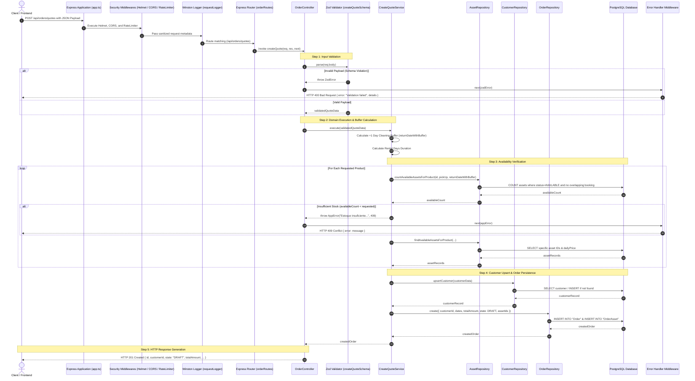
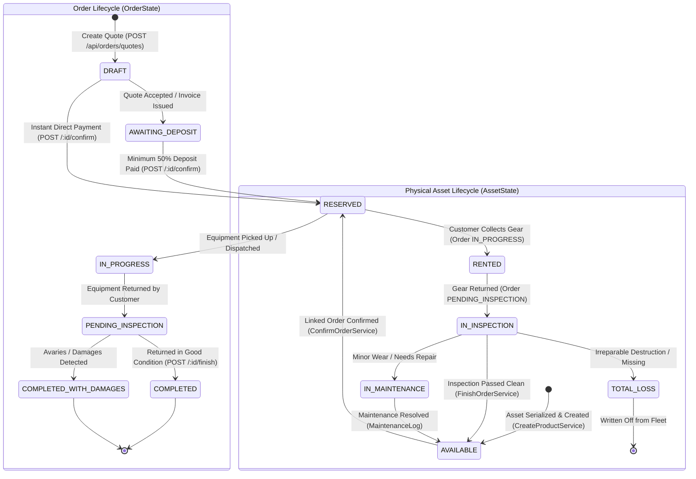
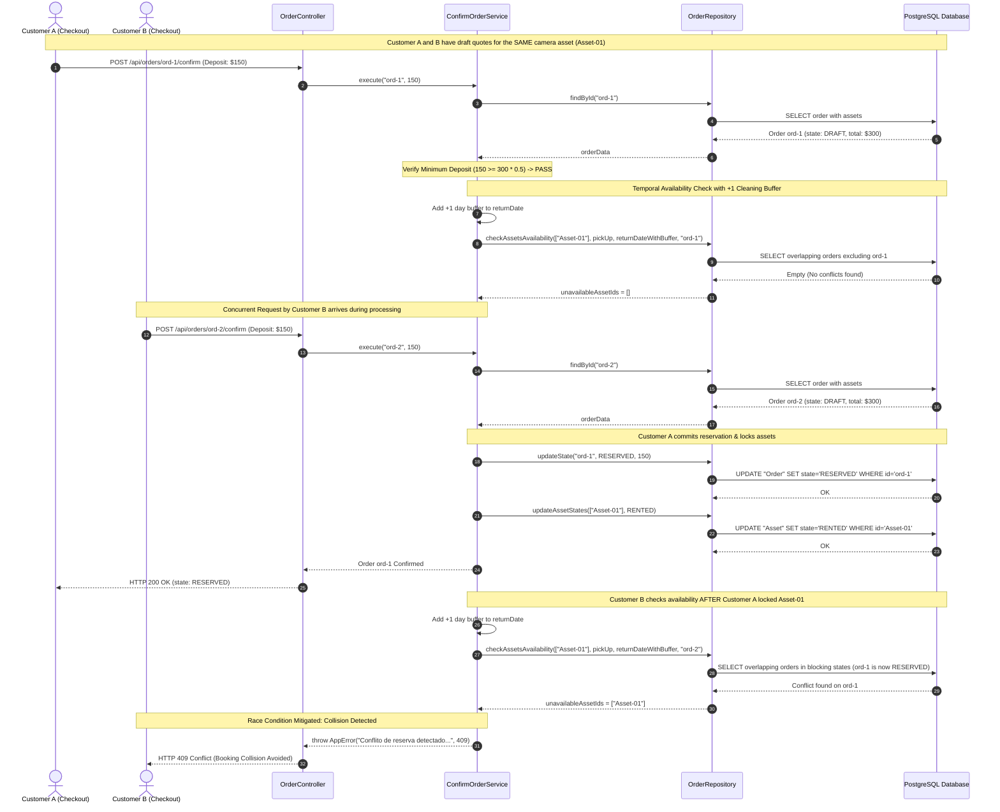

# System Architecture & Codebase Technical Audit

**System Name:** Audiovisual Equipment Rental Management System ("Pegue-e-Monte")  
**Repository Working Directory:** `/home/workspace/backend-boilerplate`  
**Version:** 1.0.0-rc  
**Runtime & Language:** Node.js 20+ (ESM), Express 5.2.1, TypeScript 6.0.3  
**Persistence & Infrastructure:** PostgreSQL 15, Prisma ORM 7.8.0, `@prisma/adapter-pg`  
**Validation & Observability:** Zod 4.4.2, Winston 3.19.0, Helmet 8.1.0, express-rate-limit 7.4.1  
**Test Harness:** Vitest 2.1.9  
**Reference Specification:** `GEMINI.md`  

---

## 1. Executive Summary & System Purpose

The **Pegue-e-Monte** backend is an enterprise-grade inventory scheduling and rental contract management system designed specifically for the audiovisual, camera gear, and event production industry. Rental businesses operate under strict physical inventory constraints: identical physical units (assets) of a given product line (e.g., Sony FX3 camera bodies, wireless lavalier microphones, LED lighting panels) are deployed across overlapping temporal windows with mandatory turnaround buffers for inspection, cleaning, firmware resetting, and battery recharging.

### 1.1 Core Business Capabilities
- **Product & Serialized Asset Fleet Tracking:** Centralized product catalog (`ProductBase`) managing aggregate daily pricing and category taxonomy, linked to individual physical serialized assets (`Asset`) with discrete lifecycle states.
- **Temporal Availability Scheduling & Buffer Enforcement:** Quote calculation logic that projects availability across calendar intervals and enforces an automatic **+1 day post-rental turnaround window** to prevent overlapping bookings before maintenance can be performed.
- **Rental Lifecycle & Concurrency Guard:** State-machine-driven order flow from draft quote to reservation, pick-up, inspection, and return, coupled with a multi-phase concurrency re-check at deposit confirmation to mitigate double-booking race conditions.
- **Promotional Bundles (Kits):** Composable multi-product package definitions (`Kit` and `KitItem`) with discounted daily pricing and favorite pinning.
- **Operational Analytics Dashboard:** Aggregated KPI metrics including fleet utilization ratios, 30-day active customer counts, in-progress contract volume, and monthly recognized revenue.

### 1.2 Technology Stack Architecture

| Layer / Concern | Technology | Version | Architectural Role |
| :--- | :--- | :--- | :--- |
| **Runtime Environment** | Node.js | `>=20.0.0` (ESM `"type": "module"`) | Modern asynchronous JavaScript runtime executing native ES Modules |
| **Web Framework** | Express | `^5.2.1` | HTTP routing pipeline with native Promise re-throw handling |
| **Language & Typing** | TypeScript | `^6.0.3` (Target `ES2022`) | Strict typing, interfaces, and compile-time verification |
| **ORM / Data Access** | Prisma Client & Adapter | `^7.8.0`, `@prisma/adapter-pg ^7.8.0` | Schema-first persistence, query builder, and PostgreSQL connection adapter |
| **Database** | PostgreSQL | `15-alpine` (Docker / Supabase) | Relational database supporting ACID transactions and relational foreign keys |
| **Input Validation** | Zod | `^4.4.2` | Runtime schema validation for request payloads, route params, and query strings |
| **HTTP Security** | Helmet & Rate Limiter | `helmet ^8.1.0`, `express-rate-limit ^7.4.1` | HTTP security response headers and IP-based brute-force prevention |
| **Structured Logging** | Winston | `^3.19.0` | Structured JSON and colorized console logging with latency tracking |
| **Testing Harness** | Vitest | `^2.1.0` | Vite-powered unit test runner with mock facilities |
| **Build & Tooling** | tsup & tsx | `tsup ^8.5.1`, `tsx ^4.21.0` | Fast esbuild-based compilation and hot-reloading development server |

---

## 2. System Architecture & Topology

The application is structured around the principles of **Clean Architecture** and **Layered Architecture**. Dependencies flow inward from external transport interfaces toward business use cases and domain models:

```
[ HTTP Clients / Frontend ]
          │
          ▼
┌─────────────────────────────────────────────────────────────┐
│ Presentation Layer (Routes, Controllers, Middlewares)        │
└──────────────────────────────┬──────────────────────────────┘
                               │
                               ▼
┌─────────────────────────────────────────────────────────────┐
│ Domain / Application Layer (Use Cases, Services, Entities)  │
└──────────────────────────────┬──────────────────────────────┘
                               │
                               ▼
┌─────────────────────────────────────────────────────────────┐
│ Persistence / Data Access Layer (Repositories, ORM, Schema) │
└──────────────────────────────┬──────────────────────────────┘
                               │
                               ▼
┌─────────────────────────────────────────────────────────────┐
│ Infrastructure Layer (PostgreSQL Database, External Pools)  │
└─────────────────────────────────────────────────────────────┘
```

### Architectural Subsystems
1. **Presentation Layer (`src/routes/`, `src/controllers/`)**: Responsible for mapping incoming HTTP requests, extracting query parameters and route parameters, executing Zod validation, delegating to domain services, and serializing HTTP response envelopes.
2. **Domain / Application Layer (`src/services/`, `src/domain/`)**: Houses all application business rules, domain state transitions, temporal collision checks, and pricing algorithms. Services are organized as single-purpose command/query use cases (`CreateQuoteService`, `ConfirmOrderService`, etc.).
3. **Persistence Layer (`src/repositories/`, `prisma/`)**: Decouples domain logic from SQL persistence mechanisms. Repositories (`OrderRepository`, `AssetRepository`, `ProductRepository`, `KitRepository`, `CustomerRepository`) encapsulate Prisma client queries and database interaction.
4. **Cross-Cutting Concerns (`src/middlewares/`, `src/errors/`, `src/schemas/`)**: Provides uniform system-wide behavior: centralized exception capture (`AppError`, `errorHandler.middleware.ts`), structured telemetry logging (`logging.middleware.ts`), and centralized validation constraints.

---

## 3. Mermaid Diagram 1: System Architecture Topology

The following diagram illustrates the structural component boundaries, middleware pipeline, use cases, repository access paths, and persistence layers:

```mermaid
graph TD
    subgraph Clients["Clients & External Consumers"]
        WebClient["Web Browser (React / Vite Frontend)"]
        MobileClient["Mobile App / HTTP API Client"]
    end

    subgraph EdgeSecurity["Security & Global Middlewares (src/app.ts)"]
        TrustProxyMiddleware["Reverse Proxy Trust (app.set trust proxy)"]
        HelmetMiddleware["Helmet (HTTP Security Headers)"]
        CorsMiddleware["CORS (Cross-Origin Resource Sharing)"]
        RateLimitMiddleware["Express Rate Limiter (100 req / 15 min)"]
        RequestLoggerMiddleware["Winston Request Logger (requestLogger)"]
    end

    subgraph RoutingLayer["Routing Layer (src/routes/)"]
        HealthRoute["GET /health"]
        OrderRoutes["Order Routes (/api/orders)"]
        ProductRoutes["Product Routes (/api/products)"]
        KitRoutes["Kit Routes (/api/kits)"]
        DashboardRoutes["Dashboard Routes (/api/dashboard)"]
    end

    subgraph PresentationLayer["Presentation Layer (src/controllers/)"]
        OrderCtrl["OrderController"]
        ProductCtrl["ProductController"]
        KitCtrl["KitController"]
        DashboardCtrl["DashboardController"]
    end

    subgraph CrossCutting["Cross-Cutting Concerns"]
        ErrorHandlerMiddleware["Central Error Handler (errorHandler)"]
        AppErrorClass["Custom AppError Class"]
        WinstonLogger["Winston Structured Logger"]
        ZodSchemas["Zod Validation Schemas (src/schemas/)"]
    end

    subgraph DomainLayer["Domain / Application Layer (src/services/)"]
        subgraph OrderServices["Order Use Cases"]
            CreateQuoteSvc["CreateQuoteService"]
            ConfirmOrderSvc["ConfirmOrderService"]
            FinishOrderSvc["FinishOrderService"]
            ListOrdersSvc["ListOrdersService"]
            UpdateOrderSvc["UpdateOrderService"]
            DeleteOrderSvc["DeleteOrderService"]
        end

        subgraph ProductServices["Product Use Cases"]
            SearchProductsSvc["SearchProductsService"]
            CreateProductSvc["CreateProductService"]
            UpdateProductSvc["UpdateProductService"]
            UpdateProductStockSvc["UpdateProductStockService"]
            DeleteProductSvc["DeleteProductService"]
        end

        subgraph KitServices["Kit Use Cases"]
            CreateKitSvc["CreateKitService"]
            ListKitsSvc["ListKitsService"]
            ToggleFavoriteKitSvc["ToggleFavoriteKitService"]
        end

        subgraph DashboardServices["Dashboard Use Cases"]
            GetDashboardStatsSvc["GetDashboardStatsService"]
        end

        subgraph DomainEntities["Domain State Models"]
            OrderStateEnum["OrderState (DRAFT..COMPLETED)"]
            AssetStateEnum["AssetState (AVAILABLE..TOTAL_LOSS)"]
        end
    end

    subgraph PersistenceLayer["Persistence Layer (src/repositories/)"]
        OrderRepo["OrderRepository"]
        AssetRepo["AssetRepository"]
        CustomerRepo["CustomerRepository"]
        ProductRepo["ProductRepository"]
        KitRepo["KitRepository"]
    end

    subgraph DatabaseInfrastructure["Database & ORM Infrastructure"]
        PrismaClientInstance["Prisma Client 7 (@prisma/adapter-pg)"]
        PostgresDatabase[("PostgreSQL 15 Database (Docker / Supabase)")]
    end

    %% Client and Edge connections
    WebClient --> TrustProxyMiddleware
    MobileClient --> TrustProxyMiddleware
    TrustProxyMiddleware --> HelmetMiddleware
    HelmetMiddleware --> CorsMiddleware
    CorsMiddleware --> RateLimitMiddleware
    RateLimitMiddleware --> RequestLoggerMiddleware

    %% Routing connections
    RequestLoggerMiddleware --> HealthRoute
    RequestLoggerMiddleware --> OrderRoutes
    RequestLoggerMiddleware --> ProductRoutes
    RequestLoggerMiddleware --> KitRoutes
    RequestLoggerMiddleware --> DashboardRoutes

    %% Controller connections
    OrderRoutes --> OrderCtrl
    ProductRoutes --> ProductCtrl
    KitRoutes --> KitCtrl
    DashboardRoutes --> DashboardCtrl

    %% Controller to Validation & Service connections
    OrderCtrl --> ZodSchemas
    ProductCtrl --> ZodSchemas
    KitCtrl --> ZodSchemas

    OrderCtrl --> CreateQuoteSvc
    OrderCtrl --> ConfirmOrderSvc
    OrderCtrl --> FinishOrderSvc
    OrderCtrl --> ListOrdersSvc
    OrderCtrl --> UpdateOrderSvc
    OrderCtrl --> DeleteOrderSvc

    ProductCtrl --> SearchProductsSvc
    ProductCtrl --> CreateProductSvc
    ProductCtrl --> UpdateProductSvc
    ProductCtrl --> UpdateProductStockSvc
    ProductCtrl --> DeleteProductSvc

    KitCtrl --> CreateKitSvc
    KitCtrl --> ListKitsSvc
    KitCtrl --> ToggleFavoriteKitSvc

    DashboardCtrl --> GetDashboardStatsSvc

    %% Service to Repository connections
    CreateQuoteSvc --> OrderRepo
    CreateQuoteSvc --> AssetRepo
    CreateQuoteSvc --> CustomerRepo
    CreateQuoteSvc --> ProductRepo

    ConfirmOrderSvc --> OrderRepo
    FinishOrderSvc --> OrderRepo
    ListOrdersSvc --> OrderRepo
    UpdateOrderSvc --> OrderRepo
    DeleteOrderSvc --> OrderRepo

    SearchProductsSvc --> ProductRepo
    CreateProductSvc --> ProductRepo
    UpdateProductSvc --> ProductRepo
    UpdateProductStockSvc --> ProductRepo
    DeleteProductSvc --> ProductRepo

    CreateKitSvc --> KitRepo
    ListKitsSvc --> KitRepo
    ToggleFavoriteKitSvc --> KitRepo

    %% Architectural Leak Note
    GetDashboardStatsSvc -.->|"Layer Leak: Bypasses Repository Layer"| PrismaClientInstance

    %% Repository to Prisma and DB connections
    OrderRepo --> PrismaClientInstance
    AssetRepo --> PrismaClientInstance
    CustomerRepo --> PrismaClientInstance
    ProductRepo --> PrismaClientInstance
    KitRepo --> PrismaClientInstance

    PrismaClientInstance --> PostgresDatabase

    %% Cross-Cutting Error Flow
    OrderCtrl -.-> ErrorHandlerMiddleware
    ProductCtrl -.-> ErrorHandlerMiddleware
    KitCtrl -.-> ErrorHandlerMiddleware
    DashboardCtrl -.-> ErrorHandlerMiddleware
    ErrorHandlerMiddleware --> WinstonLogger
    ErrorHandlerMiddleware --> AppErrorClass
```



---

## 4. Layer-by-Layer Detailed Analysis

### 4.1 Presentation Layer (`src/routes/`, `src/controllers/`)
- **Express 5 Routing Pipeline (`src/routes/`)**:
  - `order.routes.ts`: Maps endpoints `/quotes`, `/:orderId/confirm`, `/:id/finish`, `/`, `/:id` (PUT/DELETE).
  - `product.routes.ts`: Maps endpoints `/` (GET/POST), `/:id` (PUT/DELETE), `/:id/stock` (PATCH).
  - `kit.routes.ts`: Maps endpoints `/` (GET/POST), `/:id/favorite` (PATCH).
  - `dashboard.routes.ts`: Maps endpoint `/stats` (GET).
  - `src/app.ts`: Mounts routes under `/api` prefixes, defines root `/health`, and registers global security middleware.
- **Controllers (`src/controllers/`)**:
  - `OrderController.ts`: Handles quote creation (`createQuote`), confirmation (`confirmOrder`), finalization (`finishOrder`), listing (`listOrders`), date updates (`update`), and deletion (`delete`).
  - `ProductController.ts`: Handles catalog search (`index`), creation (`create`), metadata updates (`update`), stock adjustments (`updateStock`), and deletion (`delete`).
  - `KitController.ts`: Handles bundle creation (`create`), listing (`list`), and favorite toggling (`toggleFavorite`).
  - `DashboardController.ts`: Handles aggregated telemetry retrieval (`getStats`).
- **HTTP Contract**: Controllers accept JSON request bodies, URL search params, and route parameters. Responses return standardized HTTP status codes: `200 OK`, `201 Created`, `204 No Content`, `400 Bad Request`, `404 Not Found`, `409 Conflict`, `429 Too Many Requests`, and `500 Internal Server Error`.

### 4.2 Domain / Application Layer (`src/services/`, `src/domain/`)
The domain layer coordinates business invariants without coupling to HTTP protocols or database connection drivers.

- **Use Cases / Domain Services**:
  1. `CreateQuoteService`: Validates equipment availability over the selected dates **plus an automatic 1-day turnaround buffer**, calculates total contract price, upserts customer records, and creates a `DRAFT` order.
  2. `ConfirmOrderService`: Re-evaluates inventory availability to prevent double-booking race conditions during the payment window, verifies a minimum **50% deposit**, transitions the order state to `RESERVED`, and locks associated physical assets to `RENTED`.
  3. `FinishOrderService`: Verifies that orders are in an active lifecycle state, updates order status to `COMPLETED`, and transitions associated assets back to `AVAILABLE`.
  4. `UpdateOrderService`: Allows modification of rental dates and amounts, re-verifying asset availability against concurrent bookings before committing changes.
  5. `DeleteOrderService`: Restricts deletion to allowable order states (`DRAFT`, `AWAITING_DEPOSIT`, `COMPLETED`), freeing order-asset associations.
  6. `CreateProductService`: Persists a product base record and automatically instantiates the requested initial count of physical serialized assets (`PREFIX-TIMESTAMP-INDEX`).
  7. `SearchProductsService`: Performs paginated catalog queries, aggregating total asset count versus currently available asset count per product.
  8. `UpdateProductStockService`: Handles inventory expansion by generating new assets or inventory contraction by pruning `AVAILABLE` assets (preventing deletion of rented or reserved units).
  9. `DeleteProductService`: Blocks product catalog deletion if any associated assets are actively rented or have historical order relations.
  10. `CreateKitService` & `ListKitsService`: Manages promotional bundles composed of multiple base products.
  11. `ToggleFavoriteKitService`: Updates user favorite bookmarks on kits.
  12. `GetDashboardStatsService`: Computes fleet inventory counts, 30-day active client counts, active orders in progress, and monthly revenue sums.
- **Domain State Machines (`src/domain/`)**:
  - `OrderState`: `DRAFT`, `AWAITING_DEPOSIT`, `RESERVED`, `IN_PROGRESS`, `PENDING_INSPECTION`, `COMPLETED`, `COMPLETED_WITH_DAMAGES`.
  - `AssetState`: `AVAILABLE`, `RESERVED`, `RENTED`, `IN_INSPECTION`, `IN_MAINTENANCE`, `TOTAL_LOSS`.

### 4.3 Persistence Layer (`src/repositories/`, `prisma/`)
- **Repositories**:
  - `OrderRepository`: Handles order creation with nested `OrderAsset` relations, state transitions (`updateState`), asset status bulk updates (`updateAssetStates`), unpaginated listing (`findAll`), and collision detection (`checkAssetsAvailability`).
  - `AssetRepository`: Executes availability queries checking for temporal overlap against blocking order states (`AWAITING_DEPOSIT`, `RESERVED`, `IN_PROGRESS`, `PENDING_INSPECTION`).
  - `ProductRepository`: Handles product catalog persistence, paginated searches with case-insensitive name matching, and physical asset creation/pruning.
  - `KitRepository`: Manages kit definitions and nested `KitItem` records.
  - `CustomerRepository`: Implements idempotent customer lookup and creation matching unique email or government document identifiers.
- **Prisma Schema Entities (`prisma/schema.prisma`)**:
  - `Customer`: Contact profile, document (CPF/CNPJ), reliability score.
  - `ProductBase`: Catalog product definition, daily rental price (`Decimal(10,2)`), category enum (`ProductCategory`).
  - `Asset`: Physical serialized equipment unit referencing `ProductBaseId`, tracking discrete `AssetState`.
  - `Order`: Contract record linking `Customer`, dates (`pickUpDate`, `returnDate`), financial totals (`totalAmount`, `amountPaid`), and current `OrderState`.
  - `OrderAsset`: Explicit composite associative entity (`@@id([orderId, assetId])`) tracking asset assignments per rental order.
  - `Kit` & `KitItem`: Composable promotional bundles with multi-product quantities.
  - `MaintenanceLog`: Records asset servicing costs and repair status.

### 4.4 Cross-Cutting Concerns Layer
- **Error Handling Architecture (`src/errors/AppError.ts`, `src/middlewares/errorHandler.middleware.ts`)**:
  - Custom `AppError` class encapsulates expected operational errors, assigning an HTTP status code (defaults to 400).
  - Global `errorHandler` catches unhandled exceptions, differentiates between `AppError`, `ZodError`, and unexpected system crashes, masks stack traces in production, and emits warnings/errors to Winston.
- **Telemetry & Structured Logging (`src/middlewares/logging.middleware.ts`)**:
  - Uses Winston 3 with dual configuration: colorized, human-friendly output in development; machine-readable JSON in production.
  - Attaches request latency tracking (`duration: "Xms"`), HTTP status code, client IP, and request metadata.
- **Validation Pipeline (`src/schemas/`)**:
  - Runtime type enforcement using Zod schemas (`createQuoteSchema`, `confirmOrderSchema`).
- **Security Middlewares (`src/app.ts`)**:
  - `helmet`: Applies OWASP-recommended HTTP response headers (`X-Frame-Options`, `X-Content-Type-Options`, `Strict-Transport-Security`, etc.).
  - `express-rate-limit`: Enforces a threshold of 100 requests per 15-minute window per client IP.
  - `cors`: Handles cross-origin requests.

---

## 5. Mermaid Diagram 2: End-to-End Request Data Flow

The following sequence diagram traces the complete lifecycle of a rental quote creation request (`POST /api/orders/quotes`) through security filtering, validation, business buffer calculation, database querying, and persistence:



---

## 6. Domain State Machines & Lifecycle Models

The system maintains two coupled state machines: the contractual **Order Lifecycle (`OrderState`)** and the physical inventory **Asset Lifecycle (`AssetState`)**.

### 6.1 State Transition Rules & Triggers
- **Order States**:
  - `DRAFT`: Initial quote created by customer or agent; equipment availability verified with turnaround buffer, but physical units are not yet hard-locked.
  - `AWAITING_DEPOSIT`: Quote finalized and invoice dispatched; awaiting mandatory minimum 50% deposit.
  - `RESERVED`: Deposit paid and verified; physical assets locked to prevent concurrent booking.
  - `IN_PROGRESS`: Equipment checked out and collected by customer; contract active.
  - `PENDING_INSPECTION`: Equipment returned to warehouse; awaiting technical inspection and sensor/lens cleaning.
  - `COMPLETED`: Technical inspection passed with zero damage; deposit refunded/settled; physical assets returned to `AVAILABLE`.
  - `COMPLETED_WITH_DAMAGES`: Avaries detected during return inspection; repair costs deducted or billed to customer.
- **Asset States**:
  - `AVAILABLE`: Ready in warehouse inventory for immediate allocation.
  - `RESERVED`: Allocated to an upcoming confirmed order.
  - `RENTED`: Currently deployed in field with customer.
  - `IN_INSPECTION`: Returned from field; undergoing technical testing, optical cleaning, or calibration.
  - `IN_MAINTENANCE`: Defect or wear identified; undergoing bench repair or component replacement.
  - `TOTAL_LOSS`: Irreparable destruction, water damage, or theft; retired permanently from fleet.

---

## 7. Mermaid Diagram 3: State Machine Lifecycle Models

The following state diagram depicts the formal state transitions for both rental orders and serialized equipment assets:



---

## 8. Concurrency Control, Cleaning Buffer & Reservation Logic

### 8.1 Turnaround Buffer Window (+1 Day Cleaning Logic)
In audiovisual rental workflows, equipment returned on day $T$ cannot be dispatched on the morning of day $T$ or even day $T+1$ without technical risk. Cinema cameras require sensor swab cleaning, firmware verification, and optical bench inspection; lighting gear requires thermal inspection and cable testing.

The system enforces this invariant at the domain layer inside `CreateQuoteService.ts` and `ConfirmOrderService.ts`:
```typescript
// Rule: +1 day buffer for cleaning and inspection
const returnDateWithBuffer = new Date(order.returnDate);
returnDateWithBuffer.setDate(returnDateWithBuffer.getDate() + 1);
```
When querying `AssetRepository.countAvailableAssetsForProduct` or `OrderRepository.checkAssetsAvailability`, the temporal search window is projected from `pickUpDate` through `returnDateWithBuffer`. Overlapping bookings within this extended window are treated as conflicts.

### 8.2 Double-Booking Race Condition Mitigation
Because customers may hold a `DRAFT` quote for hours or days before completing payment, the system **does not hard-lock assets in draft status** (which would enable denial-of-inventory attacks). However, this creates a race condition window: two customers may attempt to confirm quotes for the same rare cine-lens simultaneously.

To prevent double-booking:
1. `ConfirmOrderService.execute` immediately re-evaluates `checkAssetsAvailability` for all assigned assets using the extended buffer window, **explicitly excluding the current order ID** (`excludeOrderId`).
2. If any asset was reserved by a competing payment in the interim, the transaction immediately aborts, throwing `AppError("Conflito de reserva detectado...", 409)`.
3. Only if zero conflicts exist does the service update `Order.state` to `RESERVED` and `Asset.state` to `RENTED`.

---

## 9. Mermaid Diagram 4: Concurrency & Order Reservation Interaction

The following sequence diagram visualizes how concurrent confirmation requests for the same physical camera asset are arbitrated, demonstrating the race condition guard:



---

## 10. Codebase Audit and Critique against GEMINI.md

An exhaustive technical audit of the codebase was conducted against the 9 architectural sections and 18 core rules mandated by `GEMINI.md`.

### 10.1 GEMINI.md Compliance Scorecard

| Guideline ID | GEMINI.md Section & Mandate | Status | Compliance Assessment & Hotspot |
| :--- | :--- | :---: | :--- |
| **G-ARCH-1** | **SOLID & Clean Code:** Small functions, SRP, early returns, guard clauses | ❌ VIOLATION | Services execute empty dummy mutations `update(id, {})` as read workarounds (`UpdateProductStockService.ts:30`). Route files act as dependency containers. |
| **G-ARCH-2** | **Design Patterns:** Appropriate patterns (Repository, Factory, Strategy); avoid overengineering | ❌ VIOLATION | Complete bypass of Repository pattern in `GetDashboardStatsService.ts:5-67`. Route modules instantiate 4 redundant connection pools. |
| **G-ARCH-3** | **Nomenclatura (Naming):** Descriptive English names; self-documenting code | ⚠️ CONCERN | Hardcoded Portuguese strings across API errors, rate limiter messages, and schema enums (`LOUÇAS`). Inconsistent file naming (`order.controller.ts` vs `ProductController.ts`). |
| **G-ARCH-4** | **Tipagem Rigorosa (Rigorous Typing):** Strict TypeScript, zero `any`, safe type narrowing | ❌ VIOLATION | **53 silent compilation errors** (`tsc --noEmit`). Invalid enum references (`OrderState.TOTAL_LOSS`), broken Zod 4 access (`err.errors`), Express 5 param types. |
| **G-BACK-1.1** | **Routes Layer:** Routes map endpoints to controllers ONLY | ❌ VIOLATION | Routes instantiate database pools (`new Pool`), Prisma clients (`new PrismaClient`), repositories, and services in module scope. |
| **G-BACK-1.2** | **Controllers Layer:** Controllers handle HTTP only; no business logic | ❌ VIOLATION | `ProductController.ts` and `order.controller.ts` intercept errors with local try/catch blocks, bypassing global error handling and formatting custom responses. |
| **G-BACK-1.3** | **Services Layer:** Services house application business logic exclusively | ✅ PASS | Business logic, buffer math, and deposit checks reside in services. |
| **G-BACK-1.4** | **Repositories Layer:** Repositories are sole layer interacting with database | ❌ VIOLATION | `GetDashboardStatsService.ts` bypasses repositories, running 5 direct ORM queries. Repositories bleed into aggregate boundaries (`ProductRepository` mutates `Asset`). |
| **G-BACK-2** | **Validação (Validation):** All inputs (Body, Params, Query) strictly validated via Zod | ❌ VIOLATION | **Zero Zod validation on route parameters** (`req.params.id`, `req.params.orderId`) across the entire application. Inline schemas inside controllers. |
| **G-BACK-3** | **Tratamento de Erros:** Global error middleware, custom `AppError`, safe production errors | ❌ VIOLATION | Controllers bypass `errorHandler` with local catch blocks. `errorHandler.middleware.ts:31` uses broken `err.errors` from Zod 4 (`err.issues`). `errorLogger` is unmounted. |
| **G-SEC-1** | **Proteção (Security):** CORS configured, Helmet enabled, Rate Limiting active | ⚠️ CONCERN | CORS has unrestricted wildcard policy (`app.use(cors())`). Rate limiter is placed before `/health`, exposing health probe to denial-of-service blocking. |
| **G-SEC-2** | **Dados Sensíveis:** Never hardcode credentials; use `process.env` | ❌ VIOLATION | Winston logger prints raw `req.headers` in cleartext (`logging.middleware.ts:44`), leaking authorization tokens and cookies into log files. |
| **G-SEC-3** | **Performance & Banco:** Pagination for lists, query optimization, proper database indexes | ❌ VIOLATION | `OrderRepository.findAll()` and `KitRepository.findAll()` perform unpaginated bulk reads. Missing database indexes on `Order` and `Asset` search columns. |
| **G-TEST-1** | **Cultura de Testes:** Code easily mockable via Dependency Inversion | ⚠️ CONCERN | 10 out of 15 services inject concrete repository classes directly instead of interfaces. Vitest mock typing breaks `tsc` checking. |
| **G-TEST-2** | **Cobertura de Testes:** Crucial unit test scenarios for complex service features | ❌ VIOLATION | **6 out of 15 services have zero unit tests** (`SearchProductsService`, `GetDashboardStatsService`, `ListOrdersService`, etc.). Zero integration tests. |

---

### 10.2 Catalog of Identified Architectural Deviations

#### Deviation 1: Multiple Redundant Database Connection Pools in Route Files
- **File Paths & Line Citations**:
  - `src/routes/order.routes.ts`: Lines 17–20
  - `src/routes/product.routes.ts`: Lines 13–16
  - `src/routes/kit.routes.ts`: Lines 11–14
  - `src/routes/dashboard.routes.ts`: Lines 8–11
- **GEMINI.md Rule Violated**:
  - `G-BACK-1.1` (Routes: Apenas mapeiam os endpoints para os controllers)
  - `G-ARCH-2` (Design Patterns: Singleton & Repository)
  - `G-SEC-3` (Performance & Connection Pooling)
- **Technical Issue**:
  Each route file instantiates its own `pg.Pool`, `PrismaPg` adapter, and `PrismaClient` instance upon import:
  ```typescript
  const connectionString = `${process.env.DATABASE_URL}`;
  const pool = new Pool({ connectionString });
  const adapter = new PrismaPg(pool);
  const prisma = new PrismaClient({ adapter });
  ```
  This creates **4 independent connection pools** and **4 separate PrismaClient engines** simultaneously. Under production traffic, each pool competes for database connections, exhausting PostgreSQL's `max_connections` (especially on pooled Supabase instances) and multiplying memory overhead.
- **Remediation Suggestion & Diff**:
  Extract a centralized database singleton in `src/infra/database.ts` and import it across repositories:
  ```diff
  --- /dev/null
  +++ b/src/infra/database.ts
  @@ -0,0 +1,11 @@
  +import { Pool } from "pg";
  +import { PrismaPg } from "@prisma/adapter-pg";
  +import { PrismaClient } from "@prisma/client";
  +
  +const connectionString = process.env.DATABASE_URL;
  +if (!connectionString) {
  +  throw new Error("DATABASE_URL environment variable is required.");
  +}
  +export const pool = new Pool({ connectionString });
  +const adapter = new PrismaPg(pool);
  +export const prisma = new PrismaClient({ adapter });
  ```

---

#### Deviation 2: Direct PrismaClient Injection in Service (Repository Layer Bypass)
- **File Path & Line Citations**:
  - `src/services/GetDashboardStatsService.ts`: Lines 1, 5, 9, 12, 21, 38, 50, 60
  - `src/routes/dashboard.routes.ts`: Line 13
- **GEMINI.md Rule Violated**:
  - `G-BACK-1.4` (Repositories/DAOs: Única camada responsável por interagir com o banco de dados)
  - `G-BACK-1.3` (Services/Use Cases: Onde vive a regra de negócio da aplicação)
- **Technical Issue**:
  `GetDashboardStatsService` bypasses the persistence layer entirely. It injects `PrismaClient` directly into its constructor and executes 5 direct database queries (`prisma.asset.count`, `prisma.order.groupBy`, `prisma.order.aggregate`, `prisma.order.findMany`). This directly couples the domain use case to Prisma ORM API specifics, making it impossible to unit test without database-level mocking.
- **Remediation Suggestion & Diff**:
  Introduce `IDashboardRepository` and `DashboardRepository`:
  ```diff
  --- a/src/services/GetDashboardStatsService.ts
  +++ b/src/services/GetDashboardStatsService.ts
  -import { PrismaClient } from "@prisma/client";
  -export class GetDashboardStatsService {
  -  constructor(private readonly prisma: PrismaClient) {}
  +export interface IDashboardRepository {
  +  getDashboardStats(): Promise<DashboardStatsData>;
  +}
  +export class GetDashboardStatsService {
  +  constructor(private readonly dashboardRepository: IDashboardRepository) {}
  +  public async execute(): Promise<DashboardStatsData> {
  +    return this.dashboardRepository.getDashboardStats();
  +  }
  ```

---

#### Deviation 3: Complete Absence of Zod Route Parameter Validation
- **File Paths & Line Citations**:
  - `src/controllers/order.controller.ts`: Lines 42, 61, 83, 107
  - `src/controllers/ProductController.ts`: Lines 67, 93, 118
  - `src/controllers/KitController.ts`: Line 53
- **GEMINI.md Rule Violated**:
  - `G-BACK-2` (Validação: Toda entrada de dados (Body, Params, Query) deve ser estritamente validada usando Zod antes de chegar aos Services)
  - `G-ARCH-4` (Tipagem Rigorosa: safe type assertions)
- **Technical Issue**:
  Every endpoint accepting route parameters (`/api/orders/:orderId/confirm`, `/api/orders/:id`, `/api/products/:id`, `/api/kits/:id/favorite`) extracts `req.params.id` or `req.params.orderId` directly into variables and forwards them unvalidated into services. In Express 5, `req.params` values are typed as `string | string[] | undefined`. Passing them without Zod validation causes TypeScript compilation failures and allows malformed, non-UUID identifiers to trigger database queries.
- **Remediation Suggestion & Diff**:
  Implement a reusable UUID parameter schema in `src/schemas/common.schema.ts` and parse route params:
  ```diff
  --- a/src/controllers/order.controller.ts
  +++ b/src/controllers/order.controller.ts
  +import { uuidParamSchema } from "../schemas/common.schema";
  +
   public async confirmOrder(req: Request, res: Response, next: NextFunction): Promise<void> {
     try {
  -    const { orderId } = req.params;
  +    const { id: orderId } = uuidParamSchema.parse({ id: req.params.orderId });
       const { paymentAmount } = confirmOrderSchema.parse(req.body);
  ```

---

#### Deviation 4: Controllers Bypassing Global Error Middleware with Local Catch Blocks
- **File Paths & Line Citations**:
  - `src/controllers/ProductController.ts`: Lines 27–37, 54–64, 80–90, 105–115, 123–130
  - `src/controllers/order.controller.ts`: Lines 94–104, 112–119
  - `src/routes/product.routes.ts`: Lines 35, 38, 41, 44, 48
- **GEMINI.md Rule Violated**:
  - `G-BACK-3` (Tratamento de Erros: Crie um middleware de erro global. Utilize classes de erro customizadas ex: AppError)
  - `G-BACK-1.2` (Controllers: Lidam apenas com a requisição e resposta HTTP)
- **Technical Issue**:
  `ProductController` and `OrderController` (`update`, `delete`) catch errors in local `try/catch` blocks, use unsafe type casts (`const err = error as { statusCode?: number; message?: string }`), and construct ad-hoc JSON error responses (`res.status(statusCode).json(...)`). This completely bypasses `errorHandler.middleware.ts`, suppresses structured Winston error logging, and causes contract inconsistency across API endpoints.
- **Remediation Suggestion & Diff**:
  Remove local catch formatting and forward errors to `next(error)`:
  ```diff
  --- a/src/controllers/ProductController.ts
  +++ b/src/controllers/ProductController.ts
  -  public async create(req: Request, res: Response): Promise<Response> {
  -    try {
  -      const data = bodySchema.parse(req.body);
  -      const product = await this.createService.execute(data);
  -      return res.status(201).json(product);
  -    } catch (error: unknown) {
  -      if (error instanceof z.ZodError) {
  -        return res.status(400).json({ error: error.errors });
  -      }
  -      const err = error as { statusCode?: number; message?: string };
  -      const statusCode = err.statusCode || 500;
  -      return res.status(statusCode).json({ message: err.message || "Erro interno ao criar produto" });
  -    }
  -  }
  +  public async create(req: Request, res: Response, next: NextFunction): Promise<void> {
  +    try {
  +      const data = createProductSchema.parse(req.body);
  +      const product = await this.createService.execute(data);
  +      res.status(201).json(product);
  +    } catch (error) {
  +      next(error);
  +    }
  +  }
  ```

---

#### Deviation 5: 53 Silent TypeScript Compilation Errors under `tsc --noEmit`
- **File Paths & Line Citations**:
  - `src/services/DeleteOrderService.ts`: Line 19
  - `src/services/FinishOrderService.ts`: Line 34
  - `src/services/UpdateOrderService.ts`: Line 30
  - `src/middlewares/errorHandler.middleware.ts`: Line 31
  - `src/repositories/AssetRepository.ts`: Line 22
  - `src/services/CreateQuoteService.ts`: Line 45
  - `src/routes/order.routes.ts`: Lines 33, 34, 63, 66
  - `src/controllers/ProductController.ts`: Lines 33, 56, 67, 82, 93, 107, 118
  - `src/tests/services/*.spec.ts`: 30+ mock typing lines
- **GEMINI.md Rule Violated**:
  - `G-ARCH-4` (Tipagem Rigorosa: O TypeScript deve ser configurado em modo strict. Nunca utilize o tipo any)
- **Technical Issue**:
  Running `npx tsc --noEmit` fails with **53 compilation errors**:
  1. `order.state === OrderState.TOTAL_LOSS`: `TOTAL_LOSS` is defined in `AssetState`, not `OrderState`.
  2. `err.errors` on `z.ZodError`: In Zod v4, `.errors` is replaced by `.issues`.
  3. `import("@prisma/client/runtime/library").Decimal`: Unresolvable internal Prisma import.
  4. Type mismatch between `OrderRepository` (returns `Prisma.Decimal`) and `IOrderRepository` (expects `number | string`).
  5. Vitest mock typings casting mocks to `Mock<Procedure>` which lack method signatures.
  Because CI only runs `tsup` (esbuild strips types without checking) and `vitest`, these 53 errors remained invisible.
- **Remediation Suggestion & Diff**:
  Fix enum references, update Zod error properties to `.issues`, import `Decimal` from `@prisma/client`, and add `"typecheck": "tsc --noEmit"` to `package.json` scripts and GitHub Actions CI workflow.

---

#### Deviation 6: Mutative Dummy Queries Used as Read Workarounds (`update(id, {})`)
- **File Paths & Line Citations**:
  - `src/services/UpdateProductStockService.ts`: Lines 30 & 59
  - `src/services/DeleteProductService.ts`: Line 9
- **GEMINI.md Rule Violated**:
  - `G-ARCH-1` (SOLID & Clean Code: O código deve ser lido como uma documentação)
  - `G-SEC-3` (Performance do Banco: Queries otimizadas no banco)
- **Technical Issue**:
  Because `ProductRepository.findById` omitted `{ include: { assets: true } }`, the developer executed `productRepository.update(id, {})` as a workaround to fetch a product with its assets. This anti-pattern issues an unnecessary `UPDATE` query against PostgreSQL, updates the `updatedAt` timestamp, acquires row-level exclusive write locks, and obscures domain intent.
- **Remediation Suggestion & Diff**:
  Add an explicit `findByIdWithAssets(id: string)` query to `ProductRepository`:
  ```diff
  --- a/src/repositories/ProductRepository.ts
  +++ b/src/repositories/ProductRepository.ts
  +  public async findByIdWithAssets(id: string) {
  +    return this.prisma.productBase.findUnique({
  +      where: { id },
  +      include: { assets: true },
  +    });
  +  }
  ```

---

#### Deviation 7: Cleartext Logging of Sensitive Request Headers
- **File Path & Line Citations**:
  - `src/middlewares/logging.middleware.ts`: Line 44
- **GEMINI.md Rule Violated**:
  - `G-SEC-2` (Dados Sensíveis: Nunca exponha credenciais ou dados sensíveis)
  - `G-SEC-1` (Proteção: Segurança e headers)
- **Technical Issue**:
  Line 44 logs incoming HTTP request headers verbatim: `headers: req.headers`. This logs sensitive authorization bearer tokens, API keys, session cookies, and credentials in plaintext to console and disk log files (`logs/combined.log`).
- **Remediation Suggestion & Diff**:
  Sanitize headers prior to emission:
  ```diff
  --- a/src/middlewares/logging.middleware.ts
  +++ b/src/middlewares/logging.middleware.ts
  +  const sanitizedHeaders = { ...req.headers };
  +  delete sanitizedHeaders.authorization;
  +  delete sanitizedHeaders.cookie;
  +  delete sanitizedHeaders["x-api-key"];
  +
     logger.info("Request started", {
       method: req.method,
       url: req.url,
       ip: req.ip,
       userAgent: req.get("User-Agent"),
  -    headers: req.headers,
  +    headers: sanitizedHeaders,
     });
  ```

---

#### Deviation 8: Insecure Permissive CORS Configuration
- **File Path & Line Citations**:
  - `src/app.ts`: Line 25
- **GEMINI.md Rule Violated**:
  - `G-SEC-1` (Proteção: Sempre implemente CORS configurado corretamente)
- **Technical Issue**:
  `app.use(cors())` is invoked without arguments, defaulting to `Access-Control-Allow-Origin: *`. This allows any malicious web origin to execute API calls against the backend.
- **Remediation Suggestion & Diff**:
  Configure CORS using an explicit domain whitelist from environment variables:
  ```diff
  --- a/src/app.ts
  +++ b/src/app.ts
  -app.use(cors());
  +const allowedOrigins = (process.env.CORS_ORIGIN || "http://localhost:5173").split(",");
  +app.use(cors({
  +  origin: (origin, callback) => {
  +    if (!origin || allowedOrigins.includes(origin)) {
  +      callback(null, true);
  +    } else {
  +      callback(new AppError("Not allowed by CORS policy", 403));
  +    }
  +  },
  +  credentials: true,
  +}));
  ```

---

#### Deviation 9: Global Rate Limiter Blocking System Healthcheck Endpoint
- **File Path & Line Citations**:
  - `src/app.ts`: Lines 28 & 31–33
- **GEMINI.md Rule Violated**:
  - `G-SEC-1` (Proteção: Rate Limiting para prevenir força bruta)
  - `G-SEC-3` (Performance e disponibilidade)
- **Technical Issue**:
  `app.use(limiter)` is mounted on line 28, *before* the `GET /health` route on line 31. This subjects automated infrastructure probes (Docker healthchecks, Kubernetes liveness probes, cloud load balancers) to the 100 requests / 15 min throttle. When the rate limit triggers, `/health` returns 429, causing cloud orchestrators to believe the container is dead and restart the service in an infinite crash loop.
- **Remediation Suggestion & Diff**:
  Mount the `/health` endpoint *before* `app.use(limiter)`:
  ```diff
  --- a/src/app.ts
  +++ b/src/app.ts
  +// Rota de Healthcheck (deve ser pública e isenta de rate limiting)
  +app.get('/health', (req: Request, res: Response) => {
  +  res.status(200).json({ status: 'OK', uptime: process.uptime() });
  +});
  +
  +app.use(limiter); // Rate Limiting aplicado apenas aos endpoints de API
  ```

---

#### Deviation 10: Non-Transactional Multi-Step Database Mutations
- **File Paths & Line Citations**:
  - `src/services/ConfirmOrderService.ts`: Lines 84–94
  - `src/repositories/OrderRepository.ts`: Lines 142–148
  - `src/repositories/ProductRepository.ts`: Lines 134–140
- **GEMINI.md Rule Violated**:
  - `G-ARCH-1` (SOLID & Clean Code: escaláveis, seguros e fáceis de manter)
  - `G-SEC-3` (Integridade transacional)
- **Technical Issue**:
  In `ConfirmOrderService`, the order state is updated to `RESERVED` first, and subsequently `updateAssetStates` updates physical assets to `RENTED`. If network latency, database disconnects, or process failure occurs between these operations, the order is reserved while the physical assets remain unallocated, corrupting inventory state.
- **Remediation Suggestion & Diff**:
  Wrap multi-step mutations inside `prisma.$transaction`:
  ```typescript
  await this.prisma.$transaction(async (tx) => {
    await tx.order.update({ where: { id: orderId }, data: { state: OrderState.RESERVED, amountPaid } });
    await tx.asset.updateMany({ where: { id: { in: assetIds } }, data: { state: AssetState.RENTED } });
  });
  ```

---

#### Deviation 11: Unpaginated Database Queries on High-Volume Collections
- **File Paths & Line Citations**:
  - `src/repositories/OrderRepository.ts`: Lines 55–71 (`findAll`)
  - `src/repositories/KitRepository.ts`: Lines 43–54 (`findAll`)
  - `src/services/ListOrdersService.ts`: Line 11
  - `src/services/ListKitsService.ts`: Line 7
- **GEMINI.md Rule Violated**:
  - `G-SEC-3` (Performance: Sugira paginação para listas longas, queries otimizadas no banco)
- **Technical Issue**:
  `OrderRepository.findAll()` performs a raw `findMany` query fetching all orders, eager-loading nested customers, nested assets, and nested product records with zero pagination (`take`/`skip`). As historical order volume grows into thousands of records, this endpoint will trigger Node.js memory bloat (OOM crashes) and severe response latency.
- **Remediation Suggestion & Diff**:
  Incorporate `page` and `limit` query parameters into `ListOrdersService` and `OrderRepository.findAll`.

---

#### Deviation 12: Missing Database Indexes on High-Frequency Columns
- **File Path & Line Citations**:
  - `prisma/schema.prisma`: Models `Order`, `Asset`, `KitItem`
- **GEMINI.md Rule Violated**:
  - `G-SEC-3` (Performance: índices adequados para buscas frequentes)
- **Technical Issue**:
  High-frequency query columns lack database indexes:
  - `Order`: `customerId`, `state`, `pickUpDate`, `returnDate` are filtered on every availability check and dashboard calculation.
  - `Asset`: `productBaseId` and `state` are queried simultaneously on every quote availability check (`findAvailableAssetsForProduct`), resulting in full table scans.
- **Remediation Suggestion & Diff**:
  Add composite indexes in `prisma/schema.prisma`:
  ```prisma
  model Order {
    // ...
    @@index([customerId])
    @@index([state])
    @@index([pickUpDate, returnDate])
  }

  model Asset {
    // ...
    @@index([productBaseId, state])
  }
  ```

---

#### Deviation 13: Incomplete Dependency Inversion in Service Constructors
- **File Paths & Line Citations**:
  - `src/services/CreateKitService.ts`: Line 6
  - `src/services/CreateProductService.ts`: Line 15
  - `src/services/DeleteOrderService.ts`: Line 6
  - `src/services/DeleteProductService.ts`: Line 6
  - `src/services/ListKitsService.ts`: Line 4
  - `src/services/SearchProductsService.ts`: Line 11
  - `src/services/ToggleFavoriteKitService.ts`: Line 6
  - `src/services/UpdateOrderService.ts`: Line 13
  - `src/services/UpdateProductService.ts`: Line 15
  - `src/services/UpdateProductStockService.ts`: Line 10
- **GEMINI.md Rule Violated**:
  - `G-TEST-1` (Cultura de Testes: O código deve ser fácil de ser mockado - Inversão de Dependência)
  - `G-ARCH-1` (SOLID: Dependency Inversion Principle)
- **Technical Issue**:
  While `CreateQuoteService` and `ConfirmOrderService` properly define and inject repository interfaces (`IOrderRepository`, `IAssetRepository`), the 10 listed services inject concrete repository classes directly (`constructor(private readonly productRepository: ProductRepository)`), violating DIP.
- **Remediation Suggestion**:
  Define repository interfaces (`IProductRepository`, `IKitRepository`) and inject interfaces into service constructors.

---

#### Deviation 14: Unit Test Coverage Gaps on Critical Services
- **File Paths & Line Citations**:
  - `src/services/CreateKitService.ts`: 0 tests
  - `src/services/GetDashboardStatsService.ts`: 0 tests
  - `src/services/ListKitsService.ts`: 0 tests
  - `src/services/ListOrdersService.ts`: 0 tests
  - `src/services/SearchProductsService.ts`: 0 tests
  - `src/services/ToggleFavoriteKitService.ts`: 0 tests
  - `src/routes/*` and `src/controllers/*`: 0 integration tests
- **GEMINI.md Rule Violated**:
  - `G-TEST-2` (Cobertura: Sempre que criar uma nova feature complexa no Service, sugira os cenários de testes unitários cruciais para ela)
- **Technical Issue**:
  40% of application use cases (6 of 15 services) have zero unit test files. Most notably, `SearchProductsService` (which contains pagination and asset availability math) and `GetDashboardStatsService` (which calculates monthly financial revenue) are completely untested.

---

## 11. Remediation Roadmap

The identified architectural deviations and technical debt items are categorized into a four-phase prioritized implementation schedule:

```
┌─────────────────────────────────────────────────────────────────────────┐
│ Phase 0 (P0 - Immediate): Compilation & Security Integrity               │
│ - Fix 53 tsc compilation errors & add "typecheck" script to CI pipeline │
│ - Fix Zod 4 err.issues and remove invalid OrderState.TOTAL_LOSS checks   │
│ - Redact cleartext request headers in Winston logging                   │
│ - Enforce CORS domain whitelist and exempt /health from rate limiting   │
└────────────────────────────────────┬────────────────────────────────────┘
                                     │
                                     ▼
┌─────────────────────────────────────────────────────────────────────────┐
│ Phase 1 (P1 - High): Layering Realignment & Connection Pooling          │
│ - Consolidate database connections into singleton (src/infra/database)  │
│ - Extract DashboardRepository to eliminate direct ORM leaks in service  │
│ - Implement findByIdWithAssets to eliminate dummy update(id, {}) hacks  │
│ - Extract Composition Root / Dependency Container for route modules     │
└────────────────────────────────────┬────────────────────────────────────┘
                                     │
                                     ▼
┌─────────────────────────────────────────────────────────────────────────┐
│ Phase 2 (P2 - Medium): Validation, Transactions & Error Handling        │
│ - Enforce Zod UUID validation on all route parameters (req.params.id)   │
│ - Centralize all inline schemas into src/schemas/                       │
│ - Eliminate local controller catch blocks; delegate to next(error)      │
│ - Wrap multi-table mutations in atomic prisma.$transaction blocks       │
└────────────────────────────────────┬────────────────────────────────────┘
                                     │
                                     ▼
┌─────────────────────────────────────────────────────────────────────────┐
│ Phase 3 (P3 - Polish & Refinement): Performance, Indexing & Hygiene     │
│ - Add composite database indexes on Order and Asset in schema.prisma    │
│ - Implement pagination on OrderRepository.findAll and KitRepository     │
│ - Implement unit tests for 6 uncovered services & integration test suite│
│ - Standardize Portuguese error messages and file naming conventions     │
└─────────────────────────────────────────────────────────────────────────┘
```

---

## 12. Conclusion & Architectural Verdict

The **Pegue-e-Monte** backend possesses a strong architectural foundation built on modern TypeScript, Express 5, and Prisma 7. The domain services effectively implement critical industry-specific business rules, particularly the **+1 day turnaround buffer** and **pre-confirmation race condition checks**.

However, the codebase requires immediate structural remediation across four core dimensions:
1. **Compilation Integrity:** Resolving the 53 hidden `tsc` compilation errors and adding compile-time verification to the build pipeline.
2. **Infrastructure Cleanliness:** Unifying the 4 separate database connection pools into a shared database singleton.
3. **Layer Isolation:** Creating a `DashboardRepository` to eliminate ORM leakage into services, and standardizing controller error delegation to the global error middleware.
4. **Boundary Security & Validation:** Adding Zod validation to route parameters, sanitizing logging headers, and establishing atomic database transactions for multi-step mutations.

Following the prioritized remediation roadmap will bring the system into full compliance with `GEMINI.md` and ensure scalable, resilient, and enterprise-grade operational reliability.
